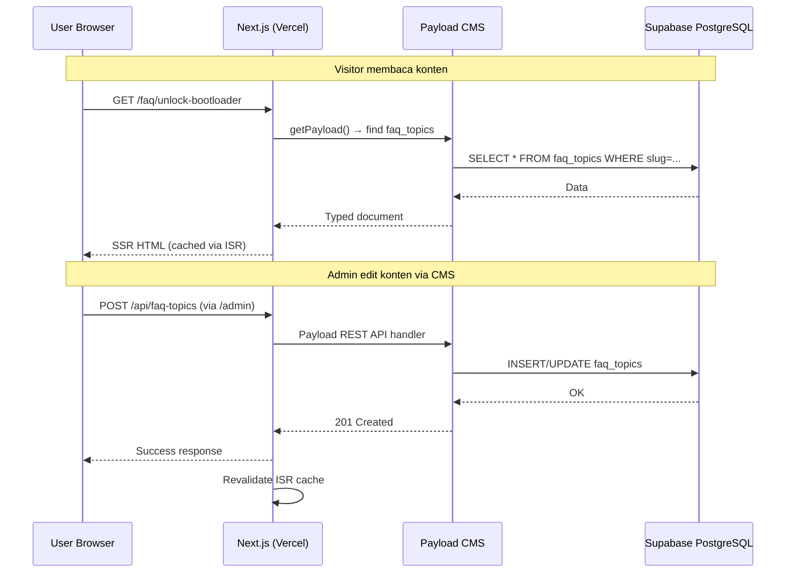

# PRD Backend — Versedroid Wiki

## Overview

Backend Versedroid Wiki dibangun di atas **Payload CMS 3** yang terintegrasi langsung dengan **Next.js 16**. Payload menyediakan admin panel, authentication, REST/GraphQL API, dan content management — semua dalam satu deployment.

## Tech Stack

| Layer | Teknologi |
|-------|-----------|
| CMS | **Payload CMS 3** (embedded di Next.js) |
| Runtime | **Next.js 16** App Router (SSR + API Routes) |
| Database | **Supabase PostgreSQL** via `@payloadcms/db-postgres` |
| Language | **TypeScript** |
| Auth | **Payload built-in auth** (JWT, session-based) |
| Media Storage | **Supabase Storage** atau Payload local upload |
| Deploy | **Vercel** |

---

## Arsitektur Sistem

### High-Level Architecture

```
┌──────────────────────────────────────────────────────────┐
│                       VERCEL                             │
│  ┌────────────────────────────────────────────────────┐  │
│  │              Next.js 16 Application                │  │
│  │                                                    │  │
│  │  ┌──────────────┐     ┌──────────────────────┐    │  │
│  │  │  Frontend    │     │  Payload CMS 3       │    │  │
│  │  │  (React SSR) │◄───▶│  (Admin + API)       │    │  │
│  │  │              │     │                      │    │  │
│  │  │  /           │     │  /admin    ← Panel   │    │  │
│  │  │  /faq/*      │     │  /api/*    ← REST    │    │  │
│  │  │  /tools/*    │     │  /graphql  ← GraphQL │    │  │
│  │  │  /blog/*     │     │                      │    │  │
│  │  └──────────────┘     └──────────┬───────────┘    │  │
│  │                                  │                 │  │
│  └──────────────────────────────────┼─────────────────┘  │
│                                     │                    │
└─────────────────────────────────────┼────────────────────┘
                                      │
                                      ▼
                            ┌──────────────────┐
                            │  SUPABASE        │
                            │  ┌────────────┐  │
                            │  │ PostgreSQL │  │
                            │  └────────────┘  │
                            │  ┌────────────┐  │
                            │  │  Storage   │  │
                            │  │  (media)   │  │
                            │  └────────────┘  │
                            └──────────────────┘
```

### Request Flow



---

## Payload CMS Configuration

### Collections

Payload Collections = tabel database + admin UI + API endpoint.

#### 1. Users (built-in)

```typescript
// Payload built-in, customized:
{
  slug: 'users',
  auth: true,
  fields: [
    { name: 'name', type: 'text', required: true },
    { name: 'role', type: 'select', options: ['admin', 'editor'] },
  ]
}
```

- **Admin panel:** `/admin` login
- **API:** `POST /api/users/login`, `POST /api/users/logout`
- **Access control:** Admin bisa semua, Editor bisa create/edit draft

#### 2. FAQ Topics

```typescript
{
  slug: 'faq-topics',
  fields: [
    { name: 'title', type: 'text', required: true, localized: true },
    { name: 'slug', type: 'text', unique: true },
    { name: 'icon', type: 'text' },
    { name: 'description', type: 'textarea', localized: true },
    { name: 'content', type: 'richText', localized: true },  // Lexical editor
    { name: 'order', type: 'number' },
    { name: 'status', type: 'select', options: ['draft', 'published'] },
    { name: 'author', type: 'relationship', relationTo: 'users' },
  ]
}
```

- **API:** `GET /api/faq-topics`, `GET /api/faq-topics?where[slug][equals]=unlock-bootloader`
- **Admin UI:** Rich text editor (Lexical) dengan callout blocks, code blocks

#### 3. Tool Guides

```typescript
{
  slug: 'tool-guides',
  fields: [
    { name: 'title', type: 'text', required: true, localized: true },
    { name: 'slug', type: 'text', unique: true },
    { name: 'icon', type: 'text' },
    { name: 'overview', type: 'richText', localized: true },
    { name: 'requirements', type: 'json' },  // { os, ram, disk, etc. }
    { name: 'downloadUrl', type: 'text' },
    { name: 'downloadVersion', type: 'text' },
    { name: 'hostGuide', type: 'richText', localized: true },
    { name: 'clientGuide', type: 'richText', localized: true },
    { name: 'troubleshooting', type: 'richText', localized: true },
    { name: 'category', type: 'select', options: ['remote', 'android', 'utility'] },
    { name: 'order', type: 'number' },
    { name: 'status', type: 'select', options: ['draft', 'published'] },
    { name: 'author', type: 'relationship', relationTo: 'users' },
  ]
}
```

#### 4. Blog Posts

```typescript
{
  slug: 'blog-posts',
  fields: [
    { name: 'title', type: 'text', required: true, localized: true },
    { name: 'slug', type: 'text', unique: true },
    { name: 'content', type: 'richText', localized: true },
    { name: 'excerpt', type: 'textarea', localized: true },
    { name: 'coverImage', type: 'upload', relationTo: 'media' },
    { name: 'author', type: 'relationship', relationTo: 'users' },
    { name: 'category', type: 'relationship', relationTo: 'categories' },
    { name: 'tags', type: 'relationship', relationTo: 'tags', hasMany: true },
    { name: 'status', type: 'select', options: ['draft', 'published'] },
    { name: 'publishedAt', type: 'date' },
    { name: 'readingTime', type: 'number' },
  ]
}
```

#### 5. Categories

```typescript
{
  slug: 'categories',
  fields: [
    { name: 'name', type: 'text', required: true, localized: true },
    { name: 'slug', type: 'text', unique: true },
    { name: 'description', type: 'textarea', localized: true },
  ]
}
```

#### 6. Tags

```typescript
{
  slug: 'tags',
  fields: [
    { name: 'name', type: 'text', required: true },
    { name: 'slug', type: 'text', unique: true },
  ]
}
```

#### 7. Media (built-in)

```typescript
{
  slug: 'media',
  upload: {
    staticDir: 'media',       // atau Supabase Storage
    mimeTypes: ['image/*'],
    imageSizes: [
      { name: 'thumbnail', width: 400 },
      { name: 'card', width: 768 },
      { name: 'cover', width: 1200 },
    ],
  },
  fields: [
    { name: 'alt', type: 'text', required: true },
  ]
}
```

---

## API Endpoints (Auto-generated by Payload)

| Method | Endpoint | Deskripsi |
|--------|----------|-----------|
| `GET` | `/api/faq-topics` | List semua FAQ topics |
| `GET` | `/api/faq-topics/:id` | Detail FAQ topic |
| `GET` | `/api/tool-guides` | List semua tool guides |
| `GET` | `/api/tool-guides/:id` | Detail tool guide |
| `GET` | `/api/blog-posts` | List semua blog posts |
| `GET` | `/api/blog-posts/:id` | Detail blog post |
| `GET` | `/api/categories` | List categories |
| `GET` | `/api/tags` | List tags |
| `GET` | `/api/media/:id` | Get media file |
| `POST` | `/api/users/login` | Admin login |
| `POST` | `/api/users/logout` | Admin logout |

**Query parameters:** Payload mendukung filtering, sorting, pagination, depth (populate relations).

```
GET /api/blog-posts?where[status][equals]=published&sort=-publishedAt&limit=10&page=1
```

---

## Access Control

| Collection | Public (Read) | Editor | Admin |
|------------|---------------|--------|-------|
| FAQ Topics | ✅ (published only) | Create, Edit own | Full CRUD |
| Tool Guides | ✅ (published only) | Create, Edit own | Full CRUD |
| Blog Posts | ✅ (published only) | Create, Edit own | Full CRUD |
| Categories | ✅ | Read only | Full CRUD |
| Tags | ✅ | Read only | Full CRUD |
| Media | ✅ | Upload | Full CRUD |
| Users | ❌ | Self only | Full CRUD |

---

## Caching Strategy (ISR)

| Halaman | Revalidate | Trigger |
|---------|------------|---------|
| Landing Page | 1 jam | — |
| FAQ Detail | On-demand | CMS publish/update FAQ |
| Tools Detail | On-demand | CMS publish/update Tool |
| Blog List | 10 menit | — |
| Blog Detail | On-demand | CMS publish/update Blog |

**Mekanisme:** Payload `afterChange` hook → trigger `revalidatePath()` Next.js.

```typescript
// Hook example di Payload collection config:
hooks: {
  afterChange: [
    async ({ doc }) => {
      // Revalidate halaman yang berubah
      revalidatePath(`/faq/${doc.slug}`)
      revalidatePath('/faq')  // revalidate index juga
    }
  ]
}
```

---

## Logging & Observability

| Aspek | Implementasi |
|-------|-------------|
| Request logging | Middleware Next.js: log semua request masuk |
| CMS activity | Payload audit log: siapa edit apa kapan |
| Error tracking | Structured error logging (JSON) |
| Correlation ID | UUID per request, propagate ke semua log |
| Health check | `GET /api/health` endpoint |

---

## Security

| Aspek | Implementasi |
|-------|-------------|
| Auth | Payload built-in JWT + HTTP-only cookies |
| CSRF | Payload CSRF protection |
| Rate limiting | Vercel built-in + custom middleware |
| Input validation | Payload field validation + sanitization |
| XSS | Rich text sanitization via Lexical |
| Admin access | `/admin` behind auth wall |
| API access | Public read, authenticated write |
| Environment vars | Supabase URL, Payload secret via Vercel env |

---

## Environment Variables

```env
# Supabase
DATABASE_URI=postgresql://...@supabase.co:5432/postgres
SUPABASE_URL=https://xxx.supabase.co
SUPABASE_ANON_KEY=eyJ...
SUPABASE_SERVICE_ROLE_KEY=eyJ...

# Payload
PAYLOAD_SECRET=random-secret-min-32-chars
NEXT_PUBLIC_SERVER_URL=https://versedroid-wiki.vercel.app

# Optional
NEXT_PUBLIC_GA_ID=G-XXXXXXXXXX
```
