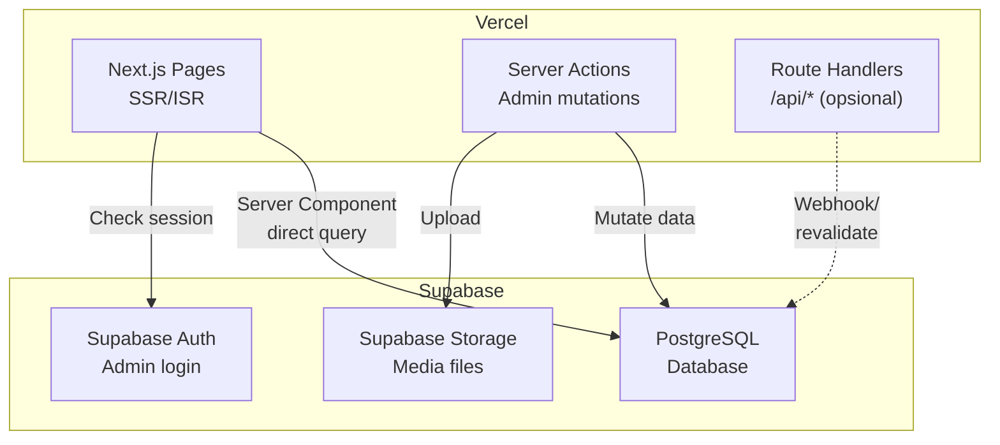
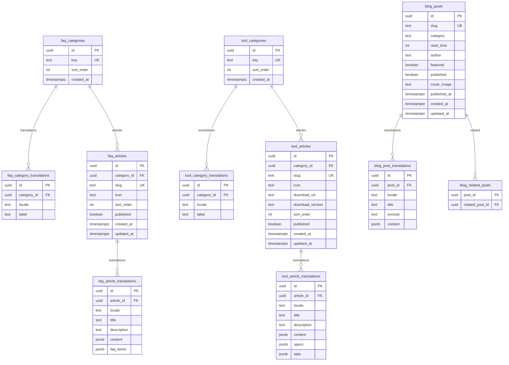

# PRD Backend & Database — Versedroid Wiki

## Overview

Backend dan database untuk website wiki edukasi **versedroid wiki**. Menggunakan arsitektur **full-stack Next.js 16** dengan **Supabase PostgreSQL** sebagai database. Menggantikan data hardcoded (`data.ts`) di frontend dengan konten yang di-manage melalui database dan admin dashboard.

### Tujuan Utama
1. **Content Management** — CRUD konten wiki (FAQ, Tools, Blog) oleh admin tanpa deploy ulang
2. **Internationalization** — Konten multi-bahasa (ID/EN) disimpan per-locale di database
3. **SEO Optimization** — Sitemap dinamis, metadata per halaman
4. **Performance** — ISR/SSG Next.js + Supabase edge caching

---

## Tech Stack

| Layer | Teknologi | Alasan |
|-------|-----------|--------|
| Framework | **Next.js 16** (App Router) | Full-stack, sudah digunakan di frontend |
| Backend Logic | **Server Actions** + **Route Handlers** | Native Next.js, zero config API |
| Database | **Supabase PostgreSQL** | Managed Postgres, Auth, Storage, Realtime |
| DB Client | **Supabase JS SDK** (`@supabase/supabase-js`) | Type-safe, auto-generated types |
| Auth | **Supabase Auth** | Built-in admin authentication |
| File Storage | **Supabase Storage** | Upload gambar blog/tools |
| Type Generation | **supabase gen types** | Database schema → TypeScript types |
| Deploy (App) | **Vercel** | Sudah digunakan untuk frontend |
| Deploy (DB) | **Supabase** (managed) | Free tier cukup untuk awal |

---

## Arsitektur

### System Overview



### Alur Data

```
┌──────────────────────────────────────────────────────┐
│  Public Pages (Server Components)                     │
│  ──────────────────────────────────────               │
│  • Langsung query Supabase di server                  │
│  • Tidak ada client-side fetch untuk konten            │
│  • ISR revalidate setiap 60 detik                     │
│  • Data sudah ter-render di HTML (SEO friendly)        │
└──────────────────────────────────────────────────────┘

┌──────────────────────────────────────────────────────┐
│  Admin Pages (Server Components + Client Interactivity)│
│  ───────────────────────────────────────────────────── │
│  • Protected by Supabase Auth (middleware check)       │
│  • Server Actions untuk create/update/delete           │
│  • Client Components untuk form dan editor             │
│  • Revalidate path setelah mutasi                      │
└──────────────────────────────────────────────────────┘
```

### Project Structure (Tambahan untuk Backend)

Struktur berikut **ditambahkan** ke project Next.js yang sudah ada:

```
src/
├── app/
│   ├── [locale]/
│   │   ├── admin/                        # Admin dashboard pages
│   │   │   ├── layout.tsx                # Admin layout + auth guard
│   │   │   ├── page.tsx                  # Admin dashboard home
│   │   │   ├── login/
│   │   │   │   └── page.tsx              # Login page
│   │   │   ├── faq/
│   │   │   │   ├── page.tsx              # FAQ list (admin)
│   │   │   │   ├── new/page.tsx          # Create FAQ
│   │   │   │   └── [id]/edit/page.tsx    # Edit FAQ
│   │   │   ├── tools/
│   │   │   │   ├── page.tsx
│   │   │   │   ├── new/page.tsx
│   │   │   │   └── [id]/edit/page.tsx
│   │   │   └── blog/
│   │   │       ├── page.tsx
│   │   │       ├── new/page.tsx
│   │   │       └── [id]/edit/page.tsx
│   │   └── ...                           # Public pages (existing)
│   └── api/
│       └── revalidate/
│           └── route.ts                  # On-demand ISR revalidation
├── features/
│   ├── faq/
│   │   ├── actions/                      # Server Actions
│   │   │   ├── queries.ts               # Read operations (public)
│   │   │   └── mutations.ts             # Write operations (admin)
│   │   ├── components/                   # (existing)
│   │   ├── types.ts                      # (updated: aligned with DB)
│   │   └── index.ts
│   ├── tools/
│   │   ├── actions/
│   │   │   ├── queries.ts
│   │   │   └── mutations.ts
│   │   └── ...
│   ├── blog/
│   │   ├── actions/
│   │   │   ├── queries.ts
│   │   │   └── mutations.ts
│   │   └── ...
│   └── admin/
│       ├── components/                   # Admin-specific UI components
│       │   ├── ContentEditor.tsx         # Block-based content editor
│       │   ├── ArticleForm.tsx           # Reusable article form
│       │   ├── MediaUploader.tsx         # Image upload component
│       │   └── LocaleSwitcher.tsx        # Edit ID/EN toggle
│       └── index.ts
├── lib/
│   ├── supabase/
│   │   ├── server.ts                    # Supabase server client
│   │   ├── client.ts                    # Supabase browser client
│   │   ├── middleware.ts                # Auth middleware helper
│   │   └── types.ts                     # Generated database types
│   └── utils.ts                         # (existing)
└── middleware.ts                         # (updated: add admin auth check)
```

---

## Database Schema (Supabase PostgreSQL)

### Entity Relationship Diagram



### SQL Migrations

```sql
-- =====================================================
-- FAQ Tables
-- =====================================================

CREATE TABLE faq_categories (
    id          UUID PRIMARY KEY DEFAULT gen_random_uuid(),
    key         TEXT NOT NULL UNIQUE,
    sort_order  INT NOT NULL DEFAULT 0,
    created_at  TIMESTAMPTZ NOT NULL DEFAULT now()
);

CREATE TABLE faq_category_translations (
    id          UUID PRIMARY KEY DEFAULT gen_random_uuid(),
    category_id UUID NOT NULL REFERENCES faq_categories(id) ON DELETE CASCADE,
    locale      TEXT NOT NULL CHECK (locale IN ('id', 'en')),
    label       TEXT NOT NULL,
    UNIQUE (category_id, locale)
);

CREATE TABLE faq_articles (
    id          UUID PRIMARY KEY DEFAULT gen_random_uuid(),
    category_id UUID NOT NULL REFERENCES faq_categories(id) ON DELETE RESTRICT,
    slug        TEXT NOT NULL UNIQUE,
    icon        TEXT NOT NULL DEFAULT '📄',
    sort_order  INT NOT NULL DEFAULT 0,
    published   BOOLEAN NOT NULL DEFAULT false,
    created_at  TIMESTAMPTZ NOT NULL DEFAULT now(),
    updated_at  TIMESTAMPTZ NOT NULL DEFAULT now()
);

CREATE TABLE faq_article_translations (
    id          UUID PRIMARY KEY DEFAULT gen_random_uuid(),
    article_id  UUID NOT NULL REFERENCES faq_articles(id) ON DELETE CASCADE,
    locale      TEXT NOT NULL CHECK (locale IN ('id', 'en')),
    title       TEXT NOT NULL,
    description TEXT NOT NULL,
    content     JSONB NOT NULL DEFAULT '[]',
    faq_items   JSONB NOT NULL DEFAULT '[]',
    UNIQUE (article_id, locale)
);

-- =====================================================
-- Tools Tables
-- =====================================================

CREATE TABLE tool_categories (
    id          UUID PRIMARY KEY DEFAULT gen_random_uuid(),
    key         TEXT NOT NULL UNIQUE,
    sort_order  INT NOT NULL DEFAULT 0,
    created_at  TIMESTAMPTZ NOT NULL DEFAULT now()
);

CREATE TABLE tool_category_translations (
    id          UUID PRIMARY KEY DEFAULT gen_random_uuid(),
    category_id UUID NOT NULL REFERENCES tool_categories(id) ON DELETE CASCADE,
    locale      TEXT NOT NULL CHECK (locale IN ('id', 'en')),
    label       TEXT NOT NULL,
    UNIQUE (category_id, locale)
);

CREATE TABLE tool_articles (
    id              UUID PRIMARY KEY DEFAULT gen_random_uuid(),
    category_id     UUID NOT NULL REFERENCES tool_categories(id) ON DELETE RESTRICT,
    slug            TEXT NOT NULL UNIQUE,
    icon            TEXT NOT NULL DEFAULT '🔧',
    download_url    TEXT NOT NULL DEFAULT '',
    download_version TEXT NOT NULL DEFAULT '',
    sort_order      INT NOT NULL DEFAULT 0,
    published       BOOLEAN NOT NULL DEFAULT false,
    created_at      TIMESTAMPTZ NOT NULL DEFAULT now(),
    updated_at      TIMESTAMPTZ NOT NULL DEFAULT now()
);

CREATE TABLE tool_article_translations (
    id          UUID PRIMARY KEY DEFAULT gen_random_uuid(),
    article_id  UUID NOT NULL REFERENCES tool_articles(id) ON DELETE CASCADE,
    locale      TEXT NOT NULL CHECK (locale IN ('id', 'en')),
    title       TEXT NOT NULL,
    description TEXT NOT NULL,
    content     JSONB NOT NULL DEFAULT '[]',
    specs       JSONB NOT NULL DEFAULT '[]',
    tabs        JSONB NOT NULL DEFAULT '[]',
    UNIQUE (article_id, locale)
);

-- =====================================================
-- Blog Tables
-- =====================================================

CREATE TABLE blog_posts (
    id           UUID PRIMARY KEY DEFAULT gen_random_uuid(),
    slug         TEXT NOT NULL UNIQUE,
    category     TEXT NOT NULL CHECK (category IN ('tutorial', 'news', 'tips')),
    read_time    INT NOT NULL DEFAULT 5,
    author       TEXT NOT NULL DEFAULT 'versedroid',
    featured     BOOLEAN NOT NULL DEFAULT false,
    published    BOOLEAN NOT NULL DEFAULT false,
    cover_image  TEXT,
    published_at TIMESTAMPTZ,
    created_at   TIMESTAMPTZ NOT NULL DEFAULT now(),
    updated_at   TIMESTAMPTZ NOT NULL DEFAULT now()
);

CREATE TABLE blog_post_translations (
    id       UUID PRIMARY KEY DEFAULT gen_random_uuid(),
    post_id  UUID NOT NULL REFERENCES blog_posts(id) ON DELETE CASCADE,
    locale   TEXT NOT NULL CHECK (locale IN ('id', 'en')),
    title    TEXT NOT NULL,
    excerpt  TEXT NOT NULL,
    content  JSONB NOT NULL DEFAULT '[]',
    UNIQUE (post_id, locale)
);

CREATE TABLE blog_related_posts (
    post_id         UUID NOT NULL REFERENCES blog_posts(id) ON DELETE CASCADE,
    related_post_id UUID NOT NULL REFERENCES blog_posts(id) ON DELETE CASCADE,
    PRIMARY KEY (post_id, related_post_id),
    CHECK (post_id != related_post_id)
);

-- =====================================================
-- Indexes
-- =====================================================

CREATE INDEX idx_faq_articles_category ON faq_articles(category_id);
CREATE INDEX idx_faq_articles_published ON faq_articles(published) WHERE published = true;
CREATE INDEX idx_faq_articles_sort ON faq_articles(sort_order);
CREATE INDEX idx_faq_article_trans_locale ON faq_article_translations(article_id, locale);

CREATE INDEX idx_tool_articles_category ON tool_articles(category_id);
CREATE INDEX idx_tool_articles_published ON tool_articles(published) WHERE published = true;
CREATE INDEX idx_tool_article_trans_locale ON tool_article_translations(article_id, locale);

CREATE INDEX idx_blog_posts_category ON blog_posts(category);
CREATE INDEX idx_blog_posts_published ON blog_posts(published) WHERE published = true;
CREATE INDEX idx_blog_posts_featured ON blog_posts(featured) WHERE featured = true;
CREATE INDEX idx_blog_post_trans_locale ON blog_post_translations(post_id, locale);

-- =====================================================
-- RLS (Row Level Security)
-- =====================================================

ALTER TABLE faq_categories ENABLE ROW LEVEL SECURITY;
ALTER TABLE faq_category_translations ENABLE ROW LEVEL SECURITY;
ALTER TABLE faq_articles ENABLE ROW LEVEL SECURITY;
ALTER TABLE faq_article_translations ENABLE ROW LEVEL SECURITY;
ALTER TABLE tool_categories ENABLE ROW LEVEL SECURITY;
ALTER TABLE tool_category_translations ENABLE ROW LEVEL SECURITY;
ALTER TABLE tool_articles ENABLE ROW LEVEL SECURITY;
ALTER TABLE tool_article_translations ENABLE ROW LEVEL SECURITY;
ALTER TABLE blog_posts ENABLE ROW LEVEL SECURITY;
ALTER TABLE blog_post_translations ENABLE ROW LEVEL SECURITY;
ALTER TABLE blog_related_posts ENABLE ROW LEVEL SECURITY;

-- Public: read published content only
CREATE POLICY "Public read faq_categories" ON faq_categories FOR SELECT USING (true);
CREATE POLICY "Public read faq_category_translations" ON faq_category_translations FOR SELECT USING (true);
CREATE POLICY "Public read faq_articles" ON faq_articles FOR SELECT USING (published = true);
CREATE POLICY "Public read faq_article_translations" ON faq_article_translations
    FOR SELECT USING (
        EXISTS (SELECT 1 FROM faq_articles WHERE id = article_id AND published = true)
    );

CREATE POLICY "Public read tool_categories" ON tool_categories FOR SELECT USING (true);
CREATE POLICY "Public read tool_category_translations" ON tool_category_translations FOR SELECT USING (true);
CREATE POLICY "Public read tool_articles" ON tool_articles FOR SELECT USING (published = true);
CREATE POLICY "Public read tool_article_translations" ON tool_article_translations
    FOR SELECT USING (
        EXISTS (SELECT 1 FROM tool_articles WHERE id = article_id AND published = true)
    );

CREATE POLICY "Public read blog_posts" ON blog_posts FOR SELECT USING (published = true);
CREATE POLICY "Public read blog_post_translations" ON blog_post_translations
    FOR SELECT USING (
        EXISTS (SELECT 1 FROM blog_posts WHERE id = post_id AND published = true)
    );
CREATE POLICY "Public read blog_related_posts" ON blog_related_posts FOR SELECT USING (true);

-- Admin: full access (authenticated users)
CREATE POLICY "Admin full access faq_categories" ON faq_categories FOR ALL USING (auth.role() = 'authenticated');
CREATE POLICY "Admin full access faq_category_translations" ON faq_category_translations FOR ALL USING (auth.role() = 'authenticated');
CREATE POLICY "Admin full access faq_articles" ON faq_articles FOR ALL USING (auth.role() = 'authenticated');
CREATE POLICY "Admin full access faq_article_translations" ON faq_article_translations FOR ALL USING (auth.role() = 'authenticated');
CREATE POLICY "Admin full access tool_categories" ON tool_categories FOR ALL USING (auth.role() = 'authenticated');
CREATE POLICY "Admin full access tool_category_translations" ON tool_category_translations FOR ALL USING (auth.role() = 'authenticated');
CREATE POLICY "Admin full access tool_articles" ON tool_articles FOR ALL USING (auth.role() = 'authenticated');
CREATE POLICY "Admin full access tool_article_translations" ON tool_article_translations FOR ALL USING (auth.role() = 'authenticated');
CREATE POLICY "Admin full access blog_posts" ON blog_posts FOR ALL USING (auth.role() = 'authenticated');
CREATE POLICY "Admin full access blog_post_translations" ON blog_post_translations FOR ALL USING (auth.role() = 'authenticated');
CREATE POLICY "Admin full access blog_related_posts" ON blog_related_posts FOR ALL USING (auth.role() = 'authenticated');

-- =====================================================
-- Auto-update updated_at trigger
-- =====================================================

CREATE OR REPLACE FUNCTION update_updated_at()
RETURNS TRIGGER AS $$
BEGIN
    NEW.updated_at = now();
    RETURN NEW;
END;
$$ LANGUAGE plpgsql;

CREATE TRIGGER faq_articles_updated_at
    BEFORE UPDATE ON faq_articles
    FOR EACH ROW EXECUTE FUNCTION update_updated_at();

CREATE TRIGGER tool_articles_updated_at
    BEFORE UPDATE ON tool_articles
    FOR EACH ROW EXECUTE FUNCTION update_updated_at();

CREATE TRIGGER blog_posts_updated_at
    BEFORE UPDATE ON blog_posts
    FOR EACH ROW EXECUTE FUNCTION update_updated_at();
```

### JSONB Content Structure

Field `content` menyimpan array `ContentBlock` — format identik dengan yang sudah digunakan frontend:

```json
[
    { "type": "heading", "text": "Judul Section", "id": "anchor-id" },
    { "type": "paragraph", "text": "Teks paragraf..." },
    { "type": "callout", "variant": "warning", "title": "Judul", "text": "Isi callout" },
    { "type": "list", "items": ["Item 1", "Item 2"] },
    { "type": "code", "language": "bash", "code": "adb reboot bootloader" }
]
```

---

## Server Actions & Queries

### Pola Akses Data

```
┌──────────────────────────────────────────────────────────────┐
│  Public Pages (Server Components)                             │
│                                                               │
│  // src/features/faq/actions/queries.ts                       │
│  export async function getFaqCategories(locale: string) {     │
│      const supabase = await createServerClient()              │
│      const { data } = await supabase                          │
│          .from('faq_categories')                              │
│          .select(`                                            │
│              *, translations:faq_category_translations(*),    │
│              articles:faq_articles(                            │
│                  *, translations:faq_article_translations(*)  │
│              )                                                │
│          `)                                                   │
│          .eq('faq_category_translations.locale', locale)      │
│          .eq('faq_articles.faq_article_translations.locale',  │
│              locale)                                          │
│          .order('sort_order')                                 │
│      return data                                              │
│  }                                                            │
└──────────────────────────────────────────────────────────────┘

┌──────────────────────────────────────────────────────────────┐
│  Admin Pages (Server Actions)                                 │
│                                                               │
│  // src/features/faq/actions/mutations.ts                     │
│  'use server'                                                 │
│  export async function createFaqArticle(formData: FormData) { │
│      const supabase = await createServerClient()              │
│      // 1. Verify admin auth                                  │
│      // 2. Validate input                                     │
│      // 3. Insert article + translations                      │
│      // 4. revalidatePath('/faq')                             │
│  }                                                            │
└──────────────────────────────────────────────────────────────┘
```

### Query Functions (Public)

#### FAQ Queries

| Function | File | Deskripsi |
|----------|------|-----------|
| `getFaqCategories(locale)` | `queries.ts` | Semua kategori + artikel (index page) |
| `getFaqBySlug(slug, locale)` | `queries.ts` | Detail artikel + content + faq_items |
| `getAdjacentFaqArticles(slug)` | `queries.ts` | Prev/next article |

#### Tools Queries

| Function | File | Deskripsi |
|----------|------|-----------|
| `getToolCategories(locale)` | `queries.ts` | Semua kategori + tools |
| `getToolBySlug(slug, locale)` | `queries.ts` | Detail tool + specs + tabs |
| `getAdjacentTools(slug)` | `queries.ts` | Prev/next tool |

#### Blog Queries

| Function | File | Deskripsi |
|----------|------|-----------|
| `getBlogPosts(locale, category?, page?)` | `queries.ts` | List posts (paginated, filterable) |
| `getFeaturedPost(locale)` | `queries.ts` | Featured post |
| `getBlogBySlug(slug, locale)` | `queries.ts` | Detail post + content |
| `getRelatedPosts(slug, locale)` | `queries.ts` | Related posts |

### Mutation Functions (Admin)

#### FAQ Mutations

| Function | Deskripsi |
|----------|-----------|
| `createFaqCategory(data)` | Create kategori + translations |
| `updateFaqCategory(id, data)` | Update kategori |
| `deleteFaqCategory(id)` | Delete kategori |
| `createFaqArticle(data)` | Create artikel + translations (ID & EN) |
| `updateFaqArticle(id, data)` | Update artikel + translations |
| `deleteFaqArticle(id)` | Delete artikel (cascade translations) |
| `toggleFaqPublish(id)` | Toggle published status |
| `reorderFaqArticles(items)` | Batch update sort_order |

#### Tools Mutations
Sama pattern seperti FAQ mutations.

#### Blog Mutations

| Function | Deskripsi |
|----------|-----------|
| `createBlogPost(data)` | Create post + translations |
| `updateBlogPost(id, data)` | Update post + translations |
| `deleteBlogPost(id)` | Delete post |
| `toggleBlogPublish(id)` | Toggle published |
| `toggleBlogFeatured(id)` | Toggle featured |
| `updateRelatedPosts(id, relatedIds)` | Set related posts |

---

## Supabase Client Setup

### Server Client (Server Components & Server Actions)

```typescript
// src/lib/supabase/server.ts
import { createServerClient } from '@supabase/ssr'
import { cookies } from 'next/headers'

export async function createClient() {
    const cookieStore = await cookies()
    return createServerClient(
        process.env.NEXT_PUBLIC_SUPABASE_URL!,
        process.env.NEXT_PUBLIC_SUPABASE_ANON_KEY!,
        {
            cookies: {
                getAll: () => cookieStore.getAll(),
                setAll: (cookiesToSet) => {
                    cookiesToSet.forEach(({ name, value, options }) =>
                        cookieStore.set(name, value, options)
                    )
                },
            },
        }
    )
}
```

### Browser Client (Client Components)

```typescript
// src/lib/supabase/client.ts
import { createBrowserClient } from '@supabase/ssr'

export function createClient() {
    return createBrowserClient(
        process.env.NEXT_PUBLIC_SUPABASE_URL!,
        process.env.NEXT_PUBLIC_SUPABASE_ANON_KEY!,
    )
}
```

### Middleware (Auth Guard)

```typescript
// src/middleware.ts (updated)
import { createServerClient } from '@supabase/ssr'
import { NextResponse } from 'next/server'

export async function middleware(request) {
    // Existing i18n routing...
    
    // Admin routes protection
    if (request.nextUrl.pathname.includes('/admin')) {
        const supabase = createServerClient(/* ... */)
        const { data: { user } } = await supabase.auth.getUser()
        
        if (!user && !request.nextUrl.pathname.includes('/login')) {
            return NextResponse.redirect('/admin/login')
        }
    }
}
```

---

## Admin Dashboard

### Fitur

| Fitur | Deskripsi |
|-------|-----------|
| **Login** | Email + password via Supabase Auth |
| **Dashboard** | Overview stats (jumlah artikel, published, draft) |
| **FAQ Editor** | CRUD FAQ articles, drag-and-drop sort, dual-locale editing |
| **Tools Editor** | CRUD tool articles, manage specs & tabs per locale |
| **Blog Editor** | CRUD blog posts, upload cover image, toggle featured |
| **Content Editor** | Block-based editor untuk ContentBlock (add/remove/reorder blocks) |
| **i18n Toggle** | Switch ID/EN saat editing, lihat kedua versi |
| **Publish Control** | Draft/Published toggle per artikel |
| **Media** | Upload gambar via Supabase Storage |

### Admin Layout

```
┌──────────────────────────────────────────────────────┐
│  versedroid. admin                    [User] [Logout] │
├──────────┬───────────────────────────────────────────┤
│          │                                           │
│  📊 Home │  Konten utama (list / form / editor)       │
│  📖 FAQ  │                                           │
│  🔧 Tools│                                           │
│  📝 Blog │                                           │
│          │                                           │
└──────────┴───────────────────────────────────────────┘
```

---

## Migrasi Data

### Dari `data.ts` ke Database

Konten yang saat ini hardcoded di `data.ts` akan dimigrasikan ke Supabase melalui **seed script**:

```
src/features/faq/data.ts    →  faq_categories + faq_articles + translations
src/features/tools/data.ts  →  tool_categories + tool_articles + translations
src/features/blog/data.ts   →  blog_posts + translations + related_posts
messages/id.json (konten)   →  *_translations (locale='id')
messages/en.json (konten)   →  *_translations (locale='en')
```

Setelah migrasi:
- File `data.ts` di setiap feature **dihapus**
- `types.ts` di-update agar sesuai dengan database schema
- Pages di-update untuk fetch dari Supabase via queries

### Apa yang Tetap di `messages/*.json`?

Hanya **UI strings** (label, button text, navigation) yang tetap di file JSON. **Konten artikel** pindah ke database.

```
messages/id.json:
  ✅ Tetap: Navbar labels, Footer text, Button text, Common strings
  ❌ Pindah ke DB: FAQ titles, FAQ descriptions, Blog titles, Tool titles
```

---

## Environment Variables

```env
# Supabase
NEXT_PUBLIC_SUPABASE_URL=https://xxxxx.supabase.co
NEXT_PUBLIC_SUPABASE_ANON_KEY=eyJhbGciOi...
SUPABASE_SERVICE_ROLE_KEY=eyJhbGciOi...      # Server-side only, untuk admin operations

# Revalidation
REVALIDATE_SECRET=<random-secret>             # Untuk on-demand ISR
```

> **PENTING:** `SUPABASE_SERVICE_ROLE_KEY` TIDAK boleh diawali `NEXT_PUBLIC_` karena ini secret server-side.

---

## Keamanan

| Aspek | Implementasi |
|-------|-------------|
| **Authentication** | Supabase Auth (email + password) |
| **Authorization** | RLS policies — public hanya bisa read published content |
| **Admin Protection** | Middleware redirect + Supabase Auth check |
| **Input Validation** | Zod schema validation di Server Actions |
| **Slug Validation** | Regex `^[a-z0-9]+(-[a-z0-9]+)*$` |
| **File Upload** | Supabase Storage policies, whitelist ekstensi (jpg, png, webp), max 5MB |
| **SQL Injection** | Supabase SDK parameterized queries |
| **XSS** | React auto-escaping + sanitize content blocks |
| **CSRF** | Server Actions built-in CSRF protection |
| **Env Secrets** | Service role key hanya di server, tidak exposed ke client |

---

## Next.js Data Fetching & Caching

| Halaman | Strategy | Revalidate |
|---------|----------|------------|
| Landing Page | SSG | On-demand |
| FAQ Index | ISR | 60 detik |
| FAQ Detail | ISR | 60 detik |
| Tools Index | ISR | 60 detik |
| Tools Detail | ISR | 60 detik |
| Blog Index | ISR | 30 detik |
| Blog Detail | ISR | 30 detik |
| Admin Pages | Dynamic (no cache) | — |

### On-Demand Revalidation

Setiap Server Action yang melakukan mutasi akan memanggil `revalidatePath()`:

```typescript
'use server'
export async function updateFaqArticle(id: string, data: FaqFormData) {
    // ... update di Supabase ...
    
    revalidatePath('/faq')                    // Revalidate index
    revalidatePath(`/faq/${data.slug}`)       // Revalidate detail
}
```

---

## Milestones / Roadmap

### Fase 1: Supabase Setup & Schema (Minggu 1)
- [ ] Setup project Supabase
- [ ] Create database schema (semua tabel + RLS + indexes)
- [ ] Setup Supabase client di Next.js (`server.ts`, `client.ts`)
- [ ] Generate TypeScript types dari schema
- [ ] Seed data dari existing `data.ts`

### Fase 2: Public Data Migration (Minggu 2)
- [ ] FAQ queries + migrasi halaman FAQ dari `data.ts` ke Supabase
- [ ] Tools queries + migrasi halaman Tools
- [ ] Blog queries + migrasi halaman Blog
- [ ] Update `types.ts` tiap feature
- [ ] Hapus `data.ts` setelah migrasi complete
- [ ] Update `messages/*.json` — hapus konten artikel, sisakan UI strings

### Fase 3: Admin Dashboard (Minggu 3-4)
- [ ] Supabase Auth setup + admin login page
- [ ] Middleware auth guard untuk `/admin/*`
- [ ] Admin layout + sidebar navigation
- [ ] FAQ admin: list, create, edit, delete, publish toggle
- [ ] Tools admin: list, create, edit, delete
- [ ] Blog admin: list, create, edit, delete, featured toggle
- [ ] ContentBlock editor component
- [ ] i18n dual-locale editing
- [ ] Media upload via Supabase Storage

### Fase 4: Polish & Deploy (Minggu 5)
- [ ] ISR + on-demand revalidation
- [ ] Input validation (Zod schemas)
- [ ] Error handling & loading states
- [ ] SEO: dynamic sitemap dari database
- [ ] Testing
- [ ] Deploy & verify

---

## Catatan Teknis

### Kenapa Full-Stack Next.js?
1. **Satu codebase** — tidak perlu maintain repo/deploy terpisah
2. **Server Components** — query langsung ke database tanpa API layer
3. **Server Actions** — mutations bawaan Next.js, built-in CSRF protection
4. **ISR** — static generation + incremental revalidation tanpa custom cache
5. **Vercel deploy** — sudah digunakan, zero additional infra

### Kenapa Supabase?
1. **Managed PostgreSQL** — tidak perlu manage server database
2. **Auth bawaan** — tidak perlu implement JWT sendiri
3. **Storage** — file upload terintegrasi
4. **RLS** — security di level database
5. **Type generation** — `supabase gen types` → TypeScript types otomatis
6. **Free tier** — cukup untuk project awal (500MB DB, 1GB storage)

### Kenapa Separate Translation Tables?
1. Query efisien — JOIN hanya locale yang diperlukan
2. Index pada `(entity_id, locale)` untuk lookup cepat
3. Mudah menambah bahasa baru tanpa alter tabel utama
4. Best practice i18n database design
